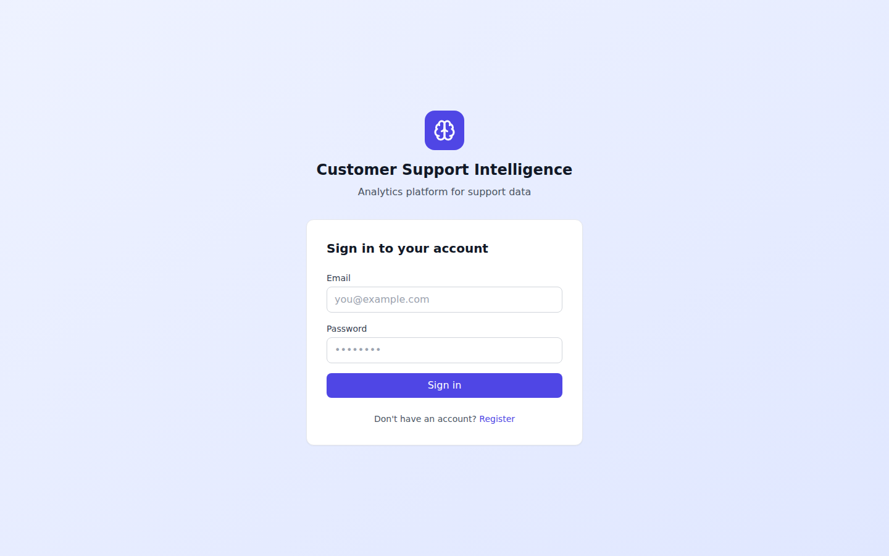
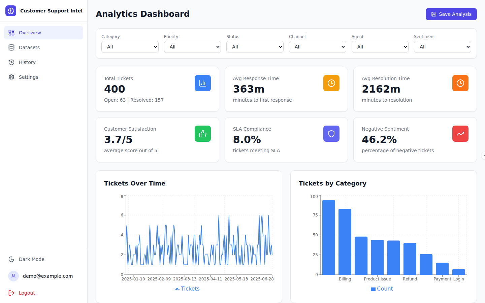
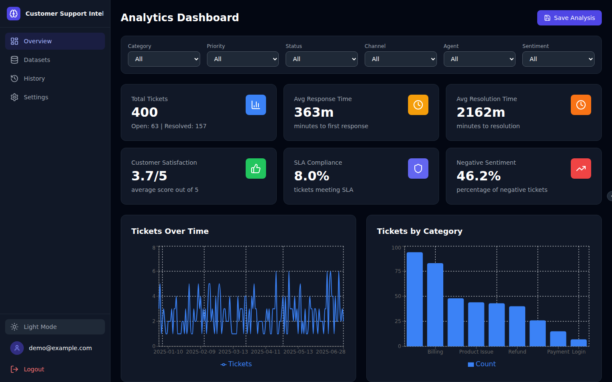
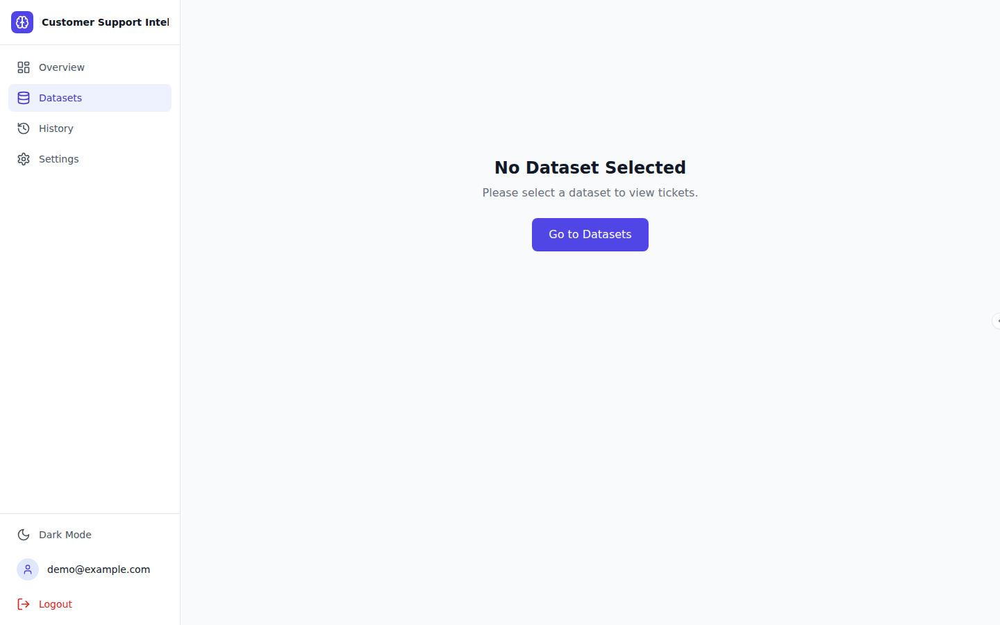
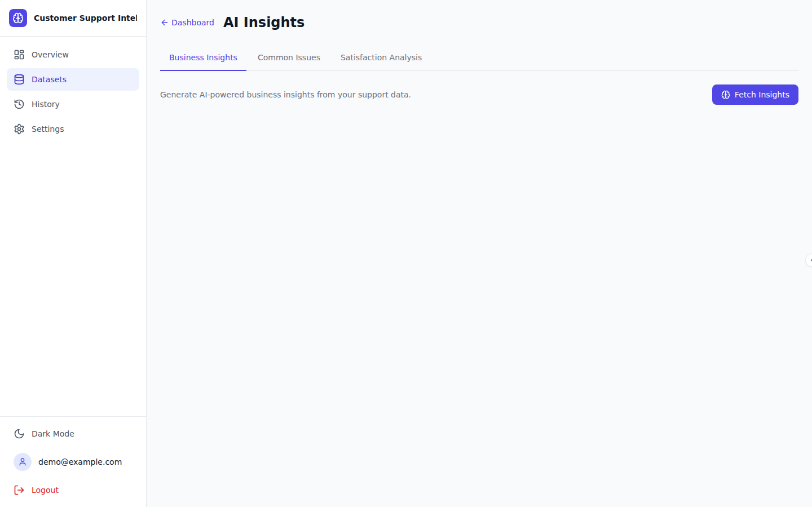
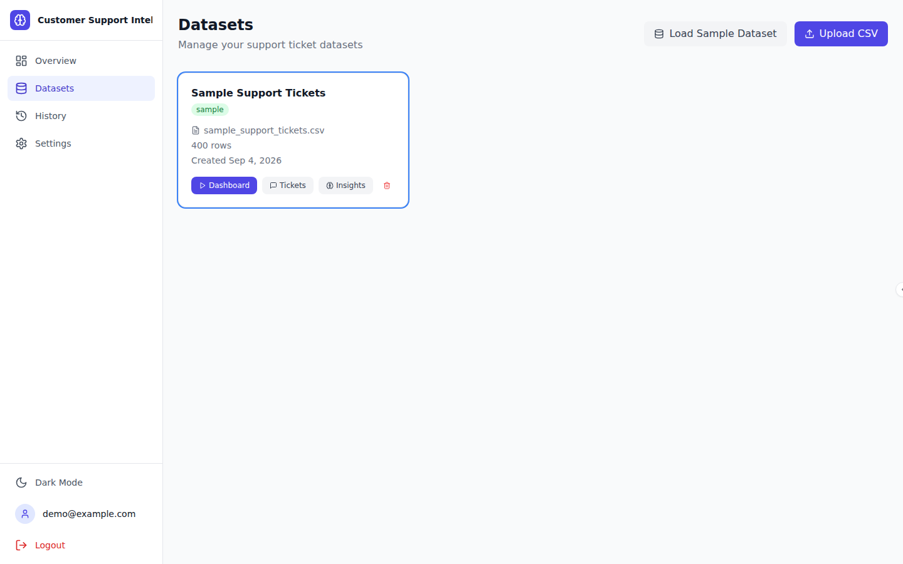
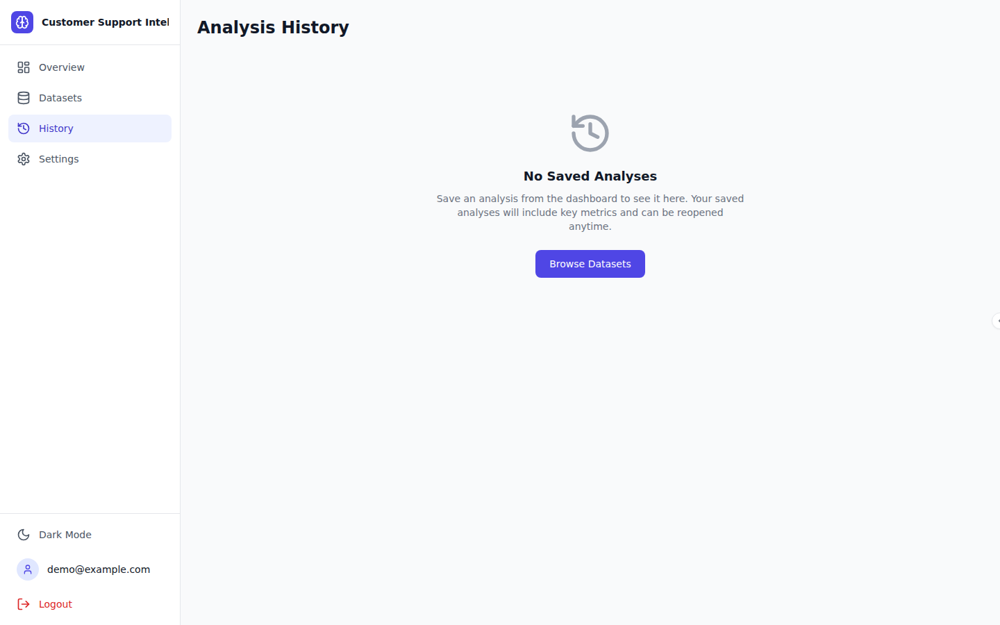
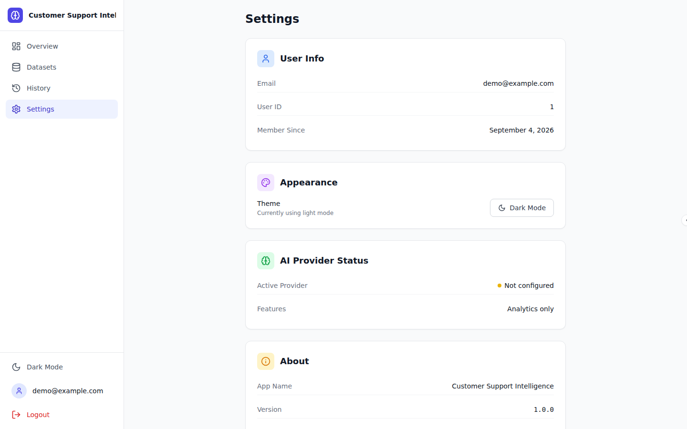

# Customer Support Intelligence

A web-based analytics platform that analyzes customer-support tickets and converts raw support data into actionable operational and business insights.

## Screenshots

<p align="center">
  
  <br/>
  <em>Secure authentication — register, login and JWT-protected routes</em>
</p>

<p align="center">
  
  <br/>
  <em>Analytics Dashboard — KPI cards and interactive charts</em>
</p>

<p align="center">
  
  <br/>
  <em>Analytics Dashboard in Dark Mode</em>
</p>

<p align="center">
  
  <br/>
  <em>Ticket Explorer — search, filter, sort and inspect tickets</em>
</p>

<p align="center">
  
  <br/>
  <em>AI Insights — business insights, common issues and satisfaction analysis</em>
</p>

<p align="center">
  
  <br/>
  <em>Dataset Management — load sample data or upload CSV</em>
</p>

<p align="center">
  
  <br/>
  <em>Analysis History — revisit saved analyses</em>
</p>

<p align="center">
  
  <br/>
  <em>Settings — user profile, theme and AI provider status</em>
</p>

## Features

- **Authentication**: Register, login, JWT-based protected routes
- **Dataset Management**: Load sample dataset (400 tickets), upload CSV files
- **CSV Processing**: Validation, column normalization, automatic sentiment analysis and categorization
- **Interactive Dashboard**: KPI cards, 8+ interactive charts (Recharts), filterable analytics
- **Ticket Explorer**: Search, sort, paginate, filter, detailed ticket view
- **Sentiment Analysis**: Rule-based NLP sentiment classifier (Positive/Neutral/Negative)
- **Ticket Classification**: Keyword-based automatic categorization into 10 categories
- **Common Issue Detection**: NLP-based detection of recurring customer problems
- **AI Insights**: Business insights and recommendations (Ollama or API-based LLM)
- **Natural Language Q&A**: Ask questions about your support data
- **Analysis History**: Save and revisit previous analyses
- **Dark/Light Mode**: Theme toggle with system preference detection
- **Animations**: Framer Motion page transitions, card animations, micro-interactions

## Architecture

```
RAW SUPPORT DATA → DATA VALIDATION → DATA PROCESSING → ANALYTICS → ML/NLP → AI INSIGHTS → BUSINESS RECOMMENDATIONS
```

### Backend
- **Framework**: FastAPI (Python)
- **Database**: PostgreSQL with SQLAlchemy ORM
- **Migrations**: Alembic
- **Auth**: JWT + bcrypt
- **Analytics**: Pandas/NumPy-powered aggregation engine
- **ML/NLP**: Rule-based sentiment analysis, keyword classification, TF-IDF clustering
- **AI Layer**: Provider abstraction (Local via Ollama / API via OpenAI-compatible)

### Frontend
- **Framework**: React 18 + TypeScript
- **Build**: Vite
- **Styling**: Tailwind CSS
- **State**: TanStack Query (React Query)
- **Routing**: React Router v6
- **Charts**: Recharts
- **Animations**: Framer Motion
- **Icons**: Lucide React

## Technology Stack

| Layer | Technology |
|-------|-----------|
| Frontend | React, Vite, TypeScript, Tailwind CSS |
| State | TanStack Query |
| Charts | Recharts |
| Animations | Framer Motion |
| Backend | FastAPI, Pydantic |
| Database | PostgreSQL, SQLAlchemy |
| Migrations | Alembic |
| Auth | JWT, bcrypt |
| ML/NLP | Custom rule-based, TF-IDF |
| AI | Ollama (local) / OpenAI-compatible API |
| Container | Docker, Docker Compose |

## Prerequisites

- Python 3.11+
- Node.js 18+
- PostgreSQL 14+ (optional — SQLite is the default for local development)
- Docker & Docker Compose (optional)
- Ollama (optional, for AI features)

## Quick Start with Docker

```bash
docker compose up --build
```

- Frontend: http://localhost:5173
- Backend API: http://localhost:8000
- API Docs: http://localhost:8000/docs
- Database: localhost:5432

### Demo Account

- **Email**: `demo@example.com`
- **Password**: `DemoPassword123!`

> This is a development credential only. Do not use in production.

## Quick Start (One-Command Scripts)

Convenience scripts for running the full stack locally (SQLite by default — no database server needed):

```bash
./start.sh   # Creates tables, seeds data, starts backend (:8000) + frontend (:5173)
./stop.sh    # Stops the running services
```

Logs are written to `/tmp/csi_backend.log` and `/tmp/csi_frontend.log`.

## Manual Setup

### 1. Database

SQLite is used by default (no setup required). For PostgreSQL:

```bash
# Start PostgreSQL and create database
createdb csi_db
```

### 2. Backend

```bash
cd backend
python3 -m venv venv
source venv/bin/activate
pip install -r requirements.txt

# Copy and configure environment
cp ../.env.example .env

# Create tables and seed data
python3 -c "from app.core.database import engine, Base; from app.models.user import User; from app.models.dataset import Dataset; from app.models.ticket import Ticket; from app.models.analysis import Analysis; Base.metadata.create_all(bind=engine)"
python3 seed.py

# Start backend
uvicorn app.main:app --reload --port 8000
```

### 3. Frontend

```bash
cd frontend
npm install
npm run dev
```

## Environment Variables

Create a `.env` file based on `.env.example`:

| Variable | Default | Description |
|----------|---------|-------------|
| `DATABASE_URL` | `sqlite:///./csi.db` | Database connection (SQLite for dev, PostgreSQL for production) |
| `JWT_SECRET_KEY` | `change-me-in-production` | JWT signing secret |
| `JWT_ALGORITHM` | `HS256` | JWT algorithm |
| `ACCESS_TOKEN_EXPIRE_MINUTES` | `60` | Token expiry |
| `CORS_ORIGINS` | `http://localhost:5173` | Allowed origins |
| `AI_PROVIDER` | `local` | `local` or `api` |
| `LOCAL_AI_BASE_URL` | `http://localhost:11434` | Ollama URL |
| `LOCAL_AI_MODEL` | (auto-detect) | Ollama model name |
| `API_AI_BASE_URL` | (empty) | OpenAI-compatible API URL |
| `API_AI_KEY` | (empty) | API key |
| `API_AI_MODEL` | (empty) | API model name |
| `MAX_UPLOAD_SIZE_MB` | `10` | Max CSV upload size |

## Local AI Setup (Ollama)

1. Install Ollama: https://ollama.ai
2. Pull a model: `ollama pull llama3.2`
3. Set `AI_PROVIDER=local` in `.env`
4. The app will automatically detect and use Ollama

## Optional API AI Setup

For external LLM providers (OpenAI, Anthropic via compatible endpoints, etc.):

```env
AI_PROVIDER=api
API_AI_BASE_URL=https://api.openai.com
API_AI_KEY=sk-your-key-here
API_AI_MODEL=gpt-4o-mini
```

## CSV Format

The app accepts CSV files with these supported columns (aliases auto-detected):

| Standard Column | Aliases |
|----------------|---------|
| `ticket_id` | id, ticket, ticket_number |
| `customer_id` | customer, client_id, user_id |
| `created_at` | created, date, submitted_at |
| `category` | issue_type, type |
| `priority` | urgency, importance |
| `status` | state, ticket_status |
| `subject` | title, summary, topic |
| `description` | message, complaint, details |
| `channel` | source, medium |
| `agent` | assigned_agent, representative |
| `satisfaction_score` | satisfaction, csat, rating |

**Minimum required**: 3+ recognizable columns including subject or description.

See `data/sample_support_tickets.csv` for a complete example.

## API Documentation

FastAPI provides automatic OpenAPI documentation:

- **Swagger UI**: http://localhost:8000/docs
- **ReDoc**: http://localhost:8000/redoc

### Key Endpoints

| Method | Endpoint | Description |
|--------|----------|-------------|
| GET | `/api/health` | Health check |
| POST | `/api/auth/register` | Register new user |
| POST | `/api/auth/login` | Login |
| GET | `/api/auth/me` | Current user |
| GET | `/api/datasets` | List datasets |
| POST | `/api/datasets/upload` | Upload CSV |
| POST | `/api/datasets/sample` | Load sample data |
| GET | `/api/datasets/{id}` | Get dataset details |
| DELETE | `/api/datasets/{id}` | Delete dataset |
| GET | `/api/datasets/{id}/analytics` | Get analytics |
| GET | `/api/datasets/{id}/analytics/filters` | Get filter options |
| GET | `/api/datasets/{id}/tickets` | List tickets |
| GET | `/api/tickets/{id}` | Get ticket |
| POST | `/api/tickets/{id}/summarize` | AI summarize |
| POST | `/api/datasets/{id}/ai/insights` | AI insights |
| POST | `/api/datasets/{id}/ai/common-issues` | Common issues |
| POST | `/api/datasets/{id}/ai/ask` | Ask question |
| GET | `/api/analyses` | History list |
| GET | `/api/analyses/{id}` | Get analysis |
| POST | `/api/analyses` | Save analysis |
| DELETE | `/api/analyses/{id}` | Delete analysis |

## Testing

```bash
cd backend
python3 -m pytest tests/ -v
```

26 tests covering:
- Authentication (registration, login, JWT protection)
- Dataset management (CRUD, upload, authorization)
- Analytics (metrics, filters)
- Tickets (list, search, pagination)
- ML/NLP (sentiment, classification, common issues)

## Project Structure

```
customer-support-intelligence/
├── frontend/                    # React + Vite + TypeScript
│   ├── src/
│   │   ├── components/         # Reusable UI components
│   │   ├── pages/              # Route pages
│   │   ├── layouts/            # App and Auth layouts
│   │   ├── hooks/              # Custom hooks
│   │   ├── services/           # API client
│   │   ├── stores/             # Auth and theme state
│   │   ├── types/              # TypeScript types
│   │   └── App.tsx             # Root component
│   └── package.json
├── backend/                     # FastAPI + SQLAlchemy
│   ├── app/
│   │   ├── api/routes/         # API endpoint handlers
│   │   ├── core/               # Config, database, security
│   │   ├── models/             # SQLAlchemy models
│   │   ├── schemas/            # Pydantic schemas
│   │   ├── analytics/          # Analytics engine
│   │   ├── ai/                 # AI provider layer
│   │   ├── ml/                 # ML/NLP modules
│   │   └── data/               # Data processing
│   ├── tests/                  # pytest tests
│   ├── alembic/                # Database migrations
│   ├── seed.py                 # Database seeder
│   └── requirements.txt
├── data/
│   └── sample_support_tickets.csv
├── docker-compose.yml
├── .env.example
├── README.md
└── ASSUMPTIONS.md
```

## Known Limitations

1. **Sentiment Analysis**: Uses rule-based NLP; not as accurate as transformer-based models
2. **Ticket Classification**: Keyword-based; may misclassify ambiguous tickets
3. **AI Features**: Require external LLM (Ollama or API) for full functionality
4. **No WebSocket**: Real-time updates not implemented
5. **Desktop-First**: Mobile layout is functional but not optimized
6. **Single-Tenant**: No multi-organization support in MVP
7. **File Format**: Only CSV uploads supported
8. **No Exports**: Dashboard/report export not included in MVP

## Future Improvements

- Transformer-based sentiment analysis (BERT, DistilBERT)
- ML-powered ticket classification with training
- Dashboard/PDF export
- Email notification integration
- Webhook support for ticket updates
- Multi-organization support
- Role-based access control
- Real-time analytics with WebSockets
- More chart types and drill-downs
- Custom dashboard builder

## License

Academic project. Not licensed for production use.
